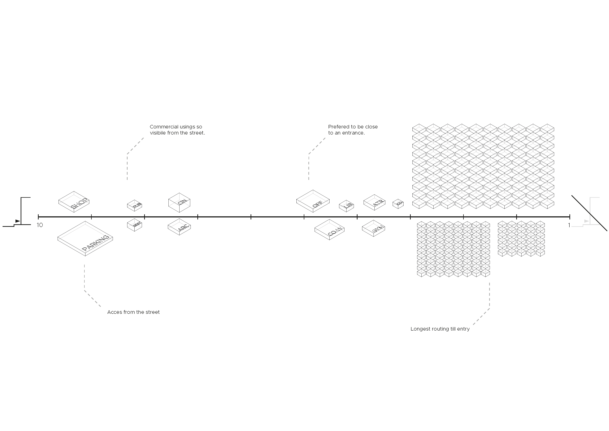

# Configuring

## Mapping relations

Before we dived into the analyses with python, we first wanted to visualize the mapping of the relations between relation.
We did this in several subdivisions with each there own main focus. These different themes are shown below.

### Sun acces

### Public Entrance acces

### Green acces

### Noise analysis

## Voxel Size

After we developped a clear notice of our wants for the building, we were able to start thinking of a proper voxel size. For this we started on the micro scale namely the stairs.

<table><thead><tr class="header"><th>Riser-Thread</th><th>2x Riser 1x Thread</th><th>Ratio</th><th>Common Denominator</th><th>Voxel Size</th></tr></thead><tbody><tr class="odd"><td>180mm x 240mm</td><td>(2 x 180) + (1 x 240) = 610</td><td>3:4</td><td>6</td><td>900x900 mm
</th></tr></thead><tbody><tr class="odd"><td></td><td></td><td></td><td></td><td>1800x1800 mm
</th></tr></thead><tbody><tr class="odd"><td></td><td></td><td></td><td></td><td>3600x3600 mm</td></tr><tr class="even"><td>
</td></tr></tbody></table>
</td></tr><tr class="even"><td>
</td></tr></tbody></table>

