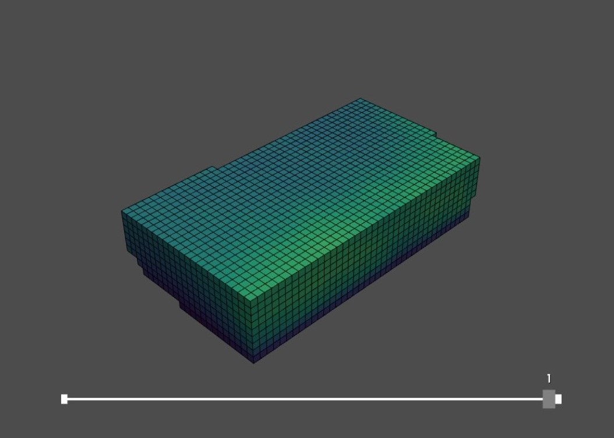
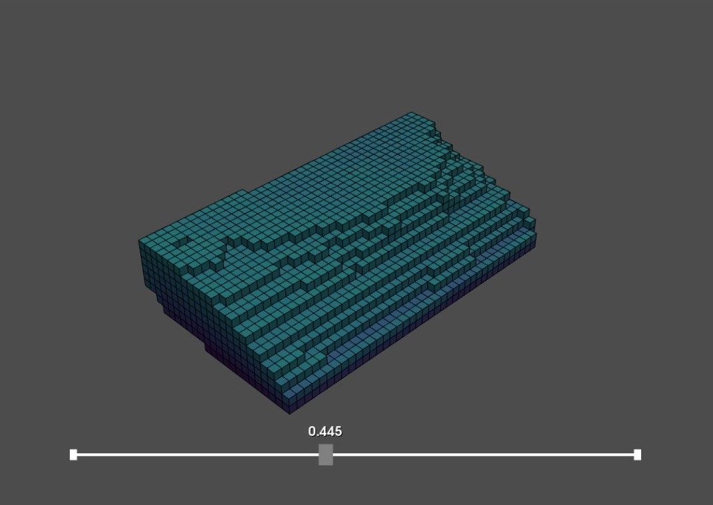

# Shadow analysis 
### Explanation

After removing the voxels with too little sun access, we have analysed the shadow casting of the new envelope. 

A part of the building envelope would provide shade for the surroundings. Because the building has a high height and is close to other buildings, we wanted to remove the voxels that have a major influence on the shadow on certain parts of the immediate context.

Just like in the sun analysis, we compute many intersections. This time, however, we are shooting rays downwards, from the pixels that represents the ecliptic to the voxels. In the code, the directions of the sun vectors are opposite to those in the sun analysis. 

``` python
# constructing the sun direction from the sun vectors in a numpy array
sun_dirs = np.array(sun_vectors)

``` 
When an intersection between the ray and the voxel is found, the sun did not reach the building behind. This means the voxel casts shadows on the 
surroundings.

### The park 

Because we want to preserve the park behind the building, we also think it is important that this remains a sunny place. That is why we have taken this into account in our analysis. we have changed the immediate context In Rhino and placed a building with a height of 1.75 meters (human height) on the place of the park. You can clearly see the difference in the shadow casting of the envelope. 

***Without taking the park into account***


***With taking the park into account***




We have removed the voxels that have over 45 percent of intersections by generating an envelope based on the selection. 
``` python
# 7.2. Generating an envelope based on the selection
lower_bound = 0.01
upper_bound = 0.45
lower_condition = shadow_casting_lattice > lower_bound
upper_condition = shadow_casting_lattice < upper_bound
new_avail_lattice = lower_condition * upper_condition

```

### New envelope
We continue the next analysis with the newly created envelope (*new_avail_lattice*).




[Shadow analysis full python code](/notebooks/shadow/)

