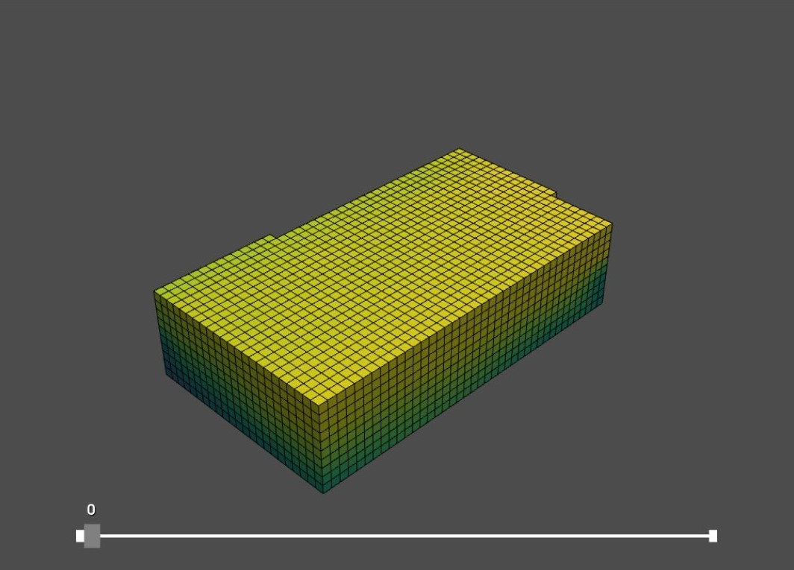
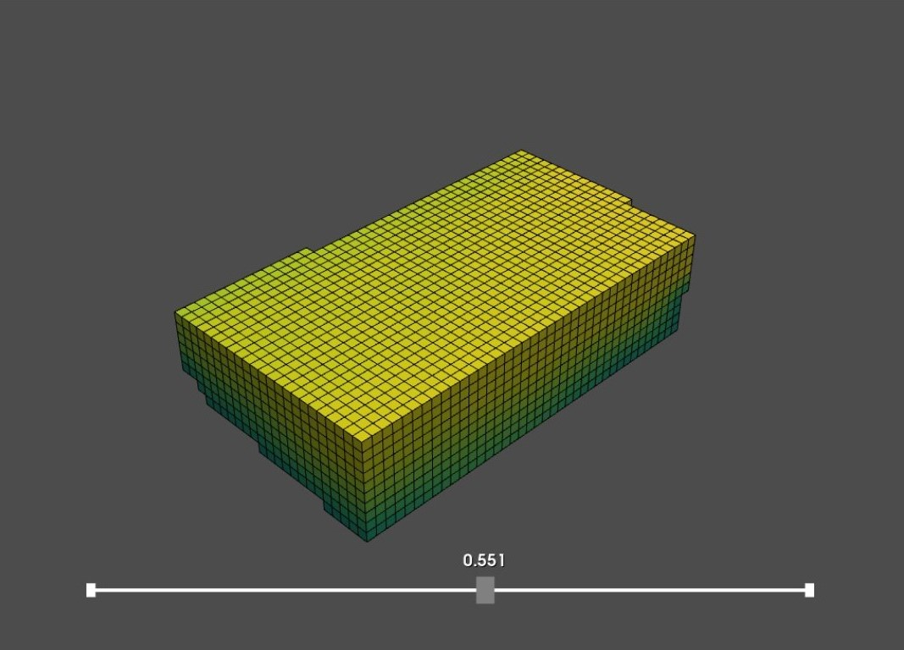

# Sun analysis
### Explanation

With the sun access analysis we wanted to gain insight into the sunny and not sunny places of the building. With that information, we want to remove the voxels that have a very low sun access and use the analysis again when placing different agents inside the voxels. 

We have started this analysis by importing the voxelized envelope and a mesh of the context and by computing the sun vectors. The main goal of the analysis is to compute the intersection of the rays with the context mesh. This is computed by shooting rays from each voxel to each of the pixels that represents the ecliptic.

``` python
# computing the intersections of rays with the context mesh
tri_id, ray_id = context_mesh.ray.intersects_id(ray_origins=ray_src, ray_directions=ray_dir, multiple_hits=False)

```
When an intersection between the ray and the context is found, the voxel does not fully see the sun and thus, has a lower percentage of sun access.

For this calculation to work and not be too expensive, we have interpolated the high resolution voxelized envelope with the computed intersections on the low resolution voxelized envelope. 
In this way, we have got the values of the sun access to each 3,6 meter by 3,6 meter voxel. 



### New envelope

We wanted our building to stay on the ground and not remove all of the lower voxels to keep a good connection between the public areas inside the envelope, the green and the hofbogen. For this reason, we have removed the voxels that have less than 55 percent of access to the sun. 
 


[Sun analysis python full python code](notebooks/sun/)


