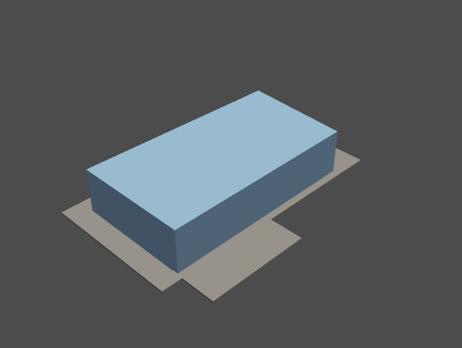
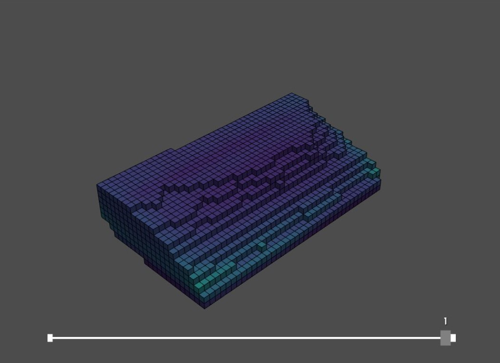
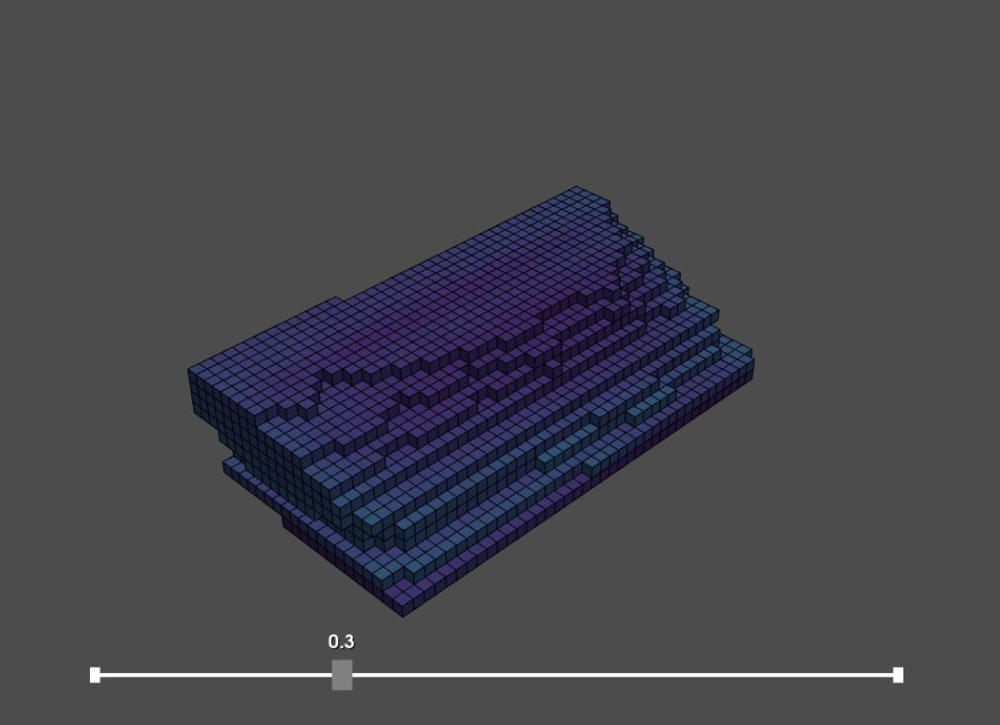

# Visibility analysis 
### Explanation
One of our starting points is to create a building that makes different connections. By this we mean connections between the various surrounding neighborhoods, between the greenery and connections inside of the building. The building should therefore not serve as a wall, but more as a passage. That is why we think it is important for people passing by, there is a good view of the sky and the surroundings. 
For this, we have calculated the sky view factor and, just like in the previous analysis, removed the unnecessary voxels.

Other than in the sun and shadow analysis we first needed to compute the sky vectors as a numpy array. We have used the icosphere function from the trimesh library and eliminated the pixels below the horizon to represent the sky. 

``` python
# Compute the sky vectors
sphere_mesh = tm.creation.icosphere(subdivisions=3, radius=1.0, color=None)
sphere_vectors = np.copy(sphere_mesh.vertices)

# remove the pixels below the horizon
sky_vectors = []
for v in sphere_vectors:
    if v[2] > 0.0:
        sky_vectors.append(v)

sky_vectors = np.array(sky_vectors)

```
Secondly, we have computed the intersections between the sky rays and the context. The rays are shooting from the voxels up to the pixels. The context only exists of the street around the building. This is because we only need to check if people walking on the streets could see the sky, or if our envelope stands in the way of this. The other surrounding buildings can be left out.



We have done the calculation on the envelope that remained after the sun and shadow analysis. 

***Visibility analysis***



The bigger the sky view, the more intersections between the rays and the street are found. When there is no intersection between them, a voxel has stand in the way of the view.

### New envelope



[Visibility analysis full python code](notebooks/visibility/)


