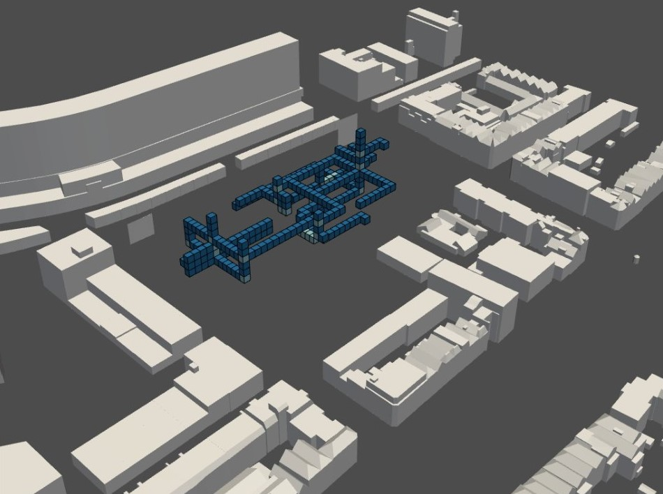

# Shortest paths

After the agents have got their optimal position, we want to connect them to each other by shafts. Because we want to make sure that there is a shaft going to the highest floor level and we want our corridors to be similar to the metronetwork, we have placed them manually. 

### Shafts


We are creating corridors in three different ways. 
The first one is to find the shortest path between an agent and a shaft. 
The second step is to first compute the shortest path from a shaft to another shaft on the ground floor, and then compute the second shortest path. In this way there will be a continuous corridor. 
In the third and last part of creating corridors we are again finding the two shortest paths between two shafts, but then on the third floor. These shafts are being created in the full envelope we have used before the atrium allocation. In this way there will be walking bridges between the three different buildings to connect them all to each other. 

### Corridors


We have used the [metronetwork](/A1_Planning/Products/#metro-network) for placing the entrances and the shafts and have also tried to achieve these connections in our corridor lattice. 


### Pseudo code 
``` python
1. Create shafts
Manually set cluster centers

place cluster center where the floor level is the highest
place cluster centers according to the metronetwork/entrances

for cluster center
	shaft lattice = cluster center extended in z direction

2. Extract the connectivity graph from the lattice
occupation index = where voxels > -1 

3. Find the shortest path and construct the corridor
for voxel in occupation index:
	for shaft voxel indices:
		find the shortest path (astar algorithm)
	
		append the shortest path to the corridor lattice

4. Find the shortest path between the shafts on the ground floor
(z dir = 0)
for shaft voxel indices:
   for shaft voxel indices: 
      find the shortest path (astar algorithm)

	 append the two shortest paths from every shaft to the 
     corridor2 lattice to get a continuous corridor

5. Find the shortest path between the shafts on the third floor
(z dir = 3)
“
	 append the two shortest paths to the corridor3 lattice 


Output: final corridor lattice  
= shaft lattice + corridor lattice + corridor lattice2 	+ corridor lattice3	
```

[Shortest path finding full python code](/notebooks/visibility/)